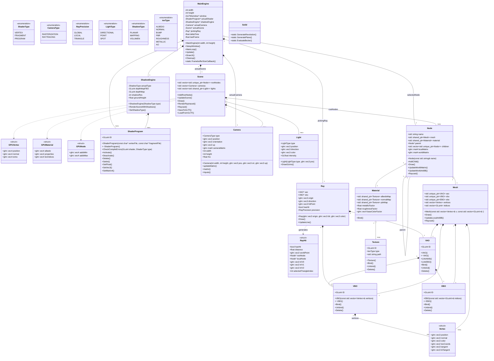

# Diagrama de Clases del Proyecto `Graficas_2`

El motor gráfico `Graficas_2` es un proyecto estructurado en módulos para el manejo eficiente de gráficos en OpenGL. A continuación, se presenta un diagrama completo de la arquitectura del proyecto y sus componentes, generados a partir de los encabezados (headers).

## Diagrama Completo (Mermaid)

## Resumen de Módulos

El proyecto se divide de forma limpia en diferentes espacios y responsabilidades que trabajan en conjunto para renderizar la imagen final.

### **1. Motor Principal (`MainEngine`)**
Es la clase base que corre la lógica completa del ciclo de vida (`MainLoop`). Administra la inicialización de GLFW, el estado de la UI (ImGui), y posee referencias únicas (`std::unique_ptr`) a la Escena, las Cámaras, el gestor de Sombras, los Shaders de dibujo, y el control de selecciones interactivas vía Raycasting.

### **2. Manejo de Buffers (`BuffersManagement`)**
- `VAO` (Vertex Array Object), `VBO` (Vertex Buffer Object), y `EBO` (Element Buffer Object) actúan como interfaces directas de alto nivel a las llamadas de memoria en la GPU de OpenGL.
- La estructura `Vertex` engloba la información completa de cada vértice (Posición, Normal, Coordenadas de Textura, Tangente y Bitangente).

### **3. Modelo y Escena (`ModelManagement`)**
- Implementa una arquitectura en **Jerarquía de Nodos**. Cada `Node` puede tener un modelo en bruto `Mesh` (con su propia geometría), un material `Material` (y sus texturas `Texture`), además de hijos dependientes y matrices de transformación locales/globales.
- La clase `Scene` es el contenedor maestro. Alberga el cache de texturas y materiales, además de los nodos raíz. Expone funciones avanzadas para guardar/cargar el formato de estándar abierto **GLTF** y renderizado por raytracing.
- La clase `Solid` provee utilidades estáticas de generación procedural, como la creación de superficies de revolución y planos.

### **4. Cámara e Interacción (`CameraManagement`)**
- Provee la implementación de una cámara clásica virtual `Camera` con vista en perspectiva, matrices de proyección y manejo de inputs para navegar en la escena 3D.
- Adicionalmente, cuenta con el módulo de interacciones a través de la clase `Ray` para trazar rayos (picking y raycasting) y la estructura `RayHit` para procesar intersecciones con polígonos del `Mesh`.

### **5. Iluminación y Sombras (`IluminationManagement`)**
- Abstrae el manejo de luces puntuales, direccionales y focos mediante `Light`.
- Incluye el sistema `ShadowEngine` que orquesta los múltiples pases de la escena para mapeo de sombras en modos Planar, de Mapeo Clásico o Volumétrico para PBR.
